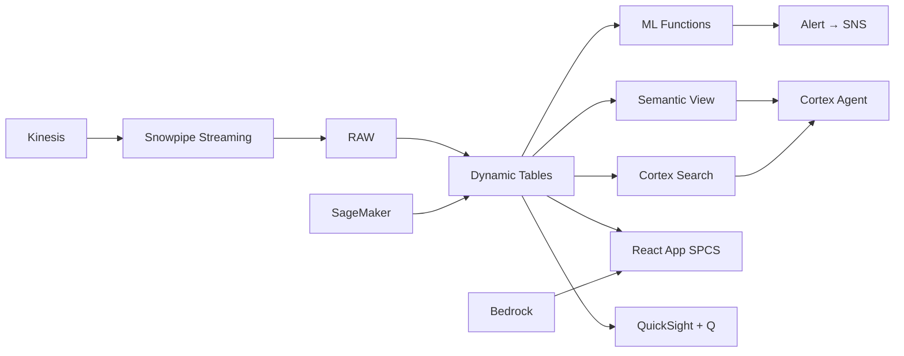

# Revenue Management & Dynamic Pricing

Dynamic pricing intelligence for 120 Thai resort properties — Kinesis streams OTA rate feeds, ML.FORECAST predicts demand by source market, and EventBridge triggers automated rate adjustments via Tasks.

## Architecture

Thailand's tourism revenue management is fragmented — 120 resort properties across 4 destinations use disconnected RMS tools while leaving ฿180M annually on the table. Real-time OTA feeds, ML demand forecasting by source market, and automated pricing via Snowflake Tasks close the gap.



## Snowflake Capabilities

| Capability | Implementation |
|-----------|---------------|
| Dynamic Tables | PROPERTY_REVPAR / DEMAND_TIMESERIES / RATE_RECOMMENDATIONS / BOOKING_PACE |
| ML Functions | ML.FORECAST + ML.ANOMALY_DETECTION |
| Cortex AI | COMPLETE, AI_CLASSIFY, AI_EXTRACT |
| Cortex Search | 600 documents indexed |
| Cortex Agent | REVENUE_INTELLIGENCE_AGENT |
| Semantic View | REVENUE_MANAGEMENT_ANALYTICS |
| React App (SPCS) | 5 tabs + DemoGuide |


## AWS Services

| Service | Role in Demo |
|---------|-------------|
| Amazon Kinesis | Stream real-time OTA rate feeds and booking events (500K feeds) |
| Amazon SageMaker | Demand forecasting model by source market and property |
| Amazon EventBridge | Trigger automated rate adjustments on demand signals |
| Amazon Bedrock (Claude) | Generate revenue strategy narratives and pricing rationale |
| Amazon SNS | Alert revenue managers on pricing opportunities |
| Amazon QuickSight + Q | RevPAR performance dashboard with natural language queries |


## Personas

| Persona | Role | Key Questions |
|---------|------|---------------|
| **Siriporn Chaiyaporn** | VP Revenue & Distribution | "What's our portfolio RevPAR vs competitive set?" "Which properties should increase rates this week?" |
| **Rattanachai Wutthisak** | Revenue Manager | "Show me the booking pace for Phuket properties vs last year." "What's the optimal BAR for next weekend at Samui Villas?" |


## Data

| Table | Rows | Description |
|-------|------|-------------|
| PROPERTIES | 120 | Resort properties across 4 Thai destinations |
| RESERVATIONS | 250,000 | 12 months of reservation data (booked, cancelled, no-show) |
| OTA_RATE_FEEDS | 500,000 | Real-time competitive rate data from OTAs (Agoda, Booking, Expedia) |
| DEMAND_SIGNALS | 180,000 | Search and booking signals by source market and date |
| REVENUE_ACTUALS | 43,800 | Daily revenue actuals by property (365 days × 120 properties) |
| COMPETITIVE_SET | 600 | Competitive set definitions (5 comps per property) |
| FLIGHT_CAPACITY | 3,000 | Inbound flight capacity by route (proxy for demand) |
| THAI_TOURISM_STATS | 12 | Thailand tourism arrival statistics by market |


## Build Instructions

### Prerequisites
- Snowflake account with ACCOUNTADMIN access
- Cortex AI enabled (ML Functions, Search, Agent)
- Warehouse: TOURISM_WH (Medium)
- AWS CLI with access (us-west-2)

### Deployment

```bash
snowsql -f snowflake/00_setup.sql
snowsql -f snowflake/01_marketplace_install.sql
snowsql -f snowflake/02_raw_tables.sql
snowsql -f snowflake/03_staging.sql
snowsql -f snowflake/04_dynamic_tables.sql
snowsql -f snowflake/05_search.sql
snowsql -f snowflake/06_ml_models.sql
snowsql -f snowflake/07_semantic_view.sql
snowsql -f snowflake/08_agent.sql
```

### React App (SPCS)
```bash
cd app && npm ci && npm run build
docker build -t aws-thailand-tourism-revenue-mgmt-app .
docker push bdiqc8sm-default.registry.snowflakecomputing.com/tourism_revenue/app/aws_thailand_tourism_revenue_mgmt/app:latest
```

### Demo Mode
Open the app URL with `?demo=true` for presenter view.

## Build Modes

### Snowflake Only
Run scripts 00-08 (skip AWS-specific integration). Uses:
- **Snowpipe Streaming SDK** instead of Amazon Kinesis
- **ML.FORECAST (native)** instead of Amazon SageMaker
- **Tasks + Streams (event-driven)** instead of Amazon EventBridge
- **Cortex Complete** instead of Amazon Bedrock (Claude)
- **Alerts + Notification Integration** instead of Amazon SNS
- **Snowflake Intelligence (Cortex Analyst)** instead of Amazon QuickSight + Q

### Full AWS + Snowflake
Run all scripts including AWS integration. Deploy QuickSight dashboard from `quicksight/`.

## Business Impact

Industry research and Snowflake customer outcomes:
- **Thailand welcomed 28 million international tourists in 2023, generating ฿1.2 trillion in revenue** — [TAT Thailand](https://www.tat.or.th/en)
- **AI-powered revenue management increases RevPAR by 5-15% through optimal pricing** — [McKinsey Travel](https://www.mckinsey.com/industries/travel-logistics-and-infrastructure/our-insights)
- **Dynamic pricing algorithms can capture 2-4% additional revenue from demand surges** — [BCG Hospitality](https://www.bcg.com/industries/travel-tourism)
- **Chinese tourists accounted for 35% of Thailand's pre-COVID tourism revenue** — [UNWTO](https://www.unwto.org/tourism-data)


## Key Demo Numbers

- **฿180M** annual revenue opportunity from sub-optimal pricing (US$5.1M)
- **7% below** portfolio RevPAR vs competitive set average
- **23% demand surge** predicted for Phuket next 30 days (ML.FORECAST)
- **500K rate feeds** ingested from OTAs via Kinesis streaming
- **120 properties** receiving dynamic rate recommendations
- **2-hour cycle** from demand signal to automated rate push


## License

Apache 2.0 — See [LICENSE](LICENSE) for details.

This is a personal demo project and is not an official Snowflake offering. It comes with no support or warranty.